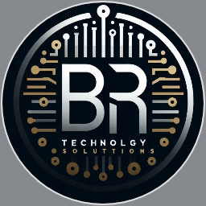

|!|

<h1 align="center">👋 Hi, I'm <b>Bruno Araujo</b></h1>
<h3 align="center">Front-end Developer | Back-end Developer</h3>

  
  
  

 

---

## 📌 **Profile**
Dedicated and adaptable developer focused on clean code, usability, and continuous learning.  
I enjoy building practical applications, exploring new technologies, and improving my technical skills every day.

---

# 💼 **Experience**

### **Front-end Junior Developer — Telemont**  
📅 *Feb 2014 – 2016*  
**Main Contributions:**  
- Assisted in interface development and layout adjustments  
- Improved user experience through UI refinements  
- Supported code documentation and front-end maintenance

### **Front-end Trainee — Serede**  
📅 *Apr 2016 – 2021*  
**Main Contributions:**  
- Participated in UI enhancements and bug fixing  
- Helped test, validate, and update front-end components  
- Contributed to maintaining visual consistency across pages

---

# 🎓 **Education & Courses**

### **Curso em Vídeo — 2024 (70h)**
✔ HTML / CSS / JavaScript  
✔ Python / Linux  
**Projects:** Django & Flask apps  

### **B7Web — 2024 (90h)**
✔ HTML5 / CSS3 / JavaScript  
✔ Node.js / React / Next.js  
**Projects:** Barber shop app, Fiber optics calculator  

---

# 🛠️ **Skills**

### **Frontend**

### **Backend / Tools**

---

# 🌎 **Languages**
| Language | Level |
|---------|--------|
| **English** | B1 – Intermediate |
| **Spanish** | B1 – Intermediate |

---

<i>“Programmers and artists are the only professionals who can call their profession a hobby.”</i>
